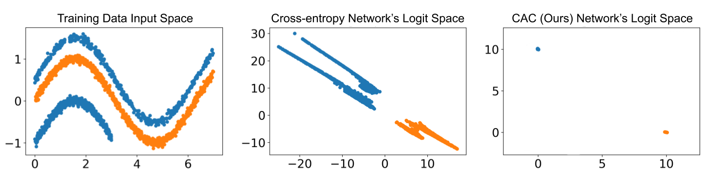

# Class Anchor Clustering: a Distance-based Loss for Training Open Set Classifiers

Class Anchor Clustering (CAC) loss is an entirely distance-based loss the explicitly encourages training data to form tight clusters around class-dependent anchor points in the logit space.



This repository contains the training and evaluation code from the paper:

**Class Anchor Clustering: a Distance-based Loss for Training Open Set Classifiers**

*Dimity Miller, Niko Suenderhauf, Michael Milford, Feras Dayoub*

[arXiv Paper](https://arxiv.org/abs/2004.02434)

If you use this work, please cite:

```text
@misc{miller2020class,
    title={Class Anchor Clustering: a Distance-based Loss for Training Open Set Classifiers},
    author={Dimity Miller and Niko Sünderhauf and Michael Milford and Feras Dayoub},
    year={2020},
    eprint={2004.02434},
    archivePrefix={arXiv},
    primaryClass={cs.CV}
}
```


**Contact**

If you have any questions or comments, please contact [Dimity Miller](mailto:dimity.miller@hdr.qut.edu.au).

## Installation

This code was developed with Python 3.6 on Ubuntu 16.04. It currently requires a GPU. 
 
### Installing via conda environment (recommended)
We have included the cac.yml file for the conda environment we used during this project. To create your own conda environment you can run:

```bash
conda env create -f cac.yml
```

You should then activate this environment before running any of the code:

```bash
conda activate cac
```

### Otherwise (without using a conda environment)
Python requirements can be installed by:

```bash
pip install -r requirements.txt
```

## Datasets
This code uses MNIST, SVHN, CIFAR10, CIFAR100 and Tiny ImageNet.

These datasets should be available in the `datasets/data/` folder inside this repository. 

### MNIST/SVHN/CIFAR10/CIFAR100
These datasets will be downloaded automatically if you run the code and they are not available in the `datasets/data/` folder.

### Tiny ImageNet
Run the following to download and setup TinyImageNet.
```bash
cd datasets/data/
./tinyimagenet.sh
```

## Pre-trained Models
The trained models used for our paper can be found in the 'networks/weights/' folder.

CAC-trained open set classifier weights are stored as:
		
	datasetName/datasetName_trialNumber_CACclassifierAnchorLoss.pth
	
Cross-entropy-trained (CE) closed set classifier weights are stored as:
		
	datasetName/datasetName_trialNumber_closedSetClassifier.pth

where:
* `datasetName` is one of: MNIST, SVHN, CIFAR10, CIFAR+10, CIFAR+50, TinyImageNet
* `trialNumber` can be trial 0-4. 

If you wish to evaluate these networks, leave the `--name` argument blank for the evaluation scripts.

## Training 
### Known/unknown class splits
The known/unknown class split for each dataset corresponds to 'trial' files. 

These files can be found in `datasets/datasetName/class_splits/trialNumber.json` where `datasetName` is MNIST, SVHN, CIFAR10, CIFAR+10, CIFAR+50 or TinyImageNet.

Each trial file contains a dictionary that holds the known/unknown class split information. For example, `CIFAR10/class_splits/0.json` contains:

```{python}
{"Known": [6, 8, 2, 4, 9, 3], "Unknown": [1, 5, 7, 0]}
```

This indicates that classes 2, 3, 4, 6, 8 and 9 in CIFAR10 are 'known' and classes 0, 1, 5 and 7 are 'unknown' during training.

You can create your own `trialNumber.json` file with a custom known/unknown class split. The `trialNumber` must be an integer number and you must reference this when calling the training script (as detailed below).


### Training an open set classifier with CAC Loss
```bash
python train_cacOpenset.py --dataset dsName --trial tNum 
```
where:

* `dsName` is the dataset to train on. Must be one of:  ['MNIST', 'SVHN', 'CIFAR10', 'CIFAR+10', 'CIFAR+50', 'TinyImageNet']
* `tNum` is the trial number corresponding to the known/unknown class split. Trial 0-4 were used in this paper.

Optional arguments:

* `-r` to resume training from a checkpoint with a lower learning rate.
* `--alpha a` where a is the magnitude of the anchor point
* `--lbda l` where l is the weighting of the Anchor component of CAC loss
* `-t` to plot the training curves on tensorboardX
* `--name n` uses n in the name for tensorboard and saving the weights. By default it is "myTest". 


### Training a standard classifier with Cross-Entropy (CE) Loss
```bash
python train_closedSet.py --dataset dsName --trial tNum 
```
where:

* `dsName` is the dataset to train on. Must be one of:  ['MNIST', 'SVHN', 'CIFAR10', 'CIFAR+10', 'CIFAR+50', 'TinyImageNet']
* `tNum` is the trial number corresponding to the known/unknown class split. Trial 0-4 were used in this paper.

Optional arguments:

* `-r` to resume training from a checkpoint with a lower learning rate.
* `-t` to plot the training curves on tensorboardX
* `--name n` uses n in the name for tensorboard and saving the weights. By default it is "myTest". 

## Evaluation
The evaluation scripts calculate the classification accuracy on the known classes and AUROC open set performance on separating known and unknown classes. For the paper, we calculate this performance averaged over trials 0-4.

For CAC-trained classifiers:
```bash
python eval_cacOpenset.py -dataset dsName 
```

For CE-trained classifiers:
```bash
python eval_closedSet.py -dataset dsName 
```

where:
* `dsName` is the dataset to evaluate. Must be one of:  ['MNIST', 'SVHN', 'CIFAR10', 'CIFAR+10', 'CIFAR+50', 'TinyImageNet']

Optional arguments:
* `--num_trials nt` where nt is the number of trials to average performance over. By default it is 5. To evaluate one network you have trained, use nt as 1. 
* `--start_trial st` where st is the starting trial number for evaluation. By default it is 0. You can change this to a custom trial number you have created and trained on. 
* `--name n` uses n is the name used when saving the weights. By default it is "". If you have trained your own networks, use "myTest".

